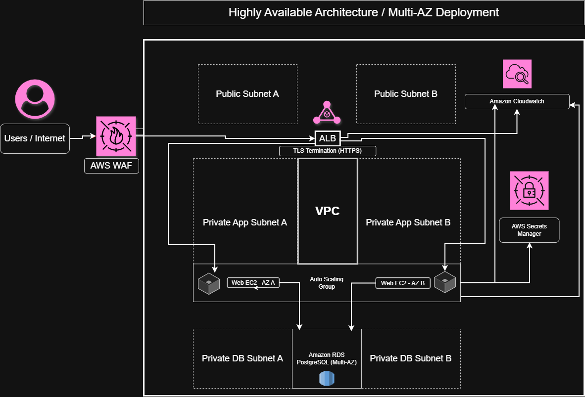

# Highly Available & Secure Web Application on AWS with Terraform

This project demonstrates the design and deployment of a highly available, secure, and production-style AWS architecture using Infrastructure as Code (Terraform).

## Why This Project

This project was built to demonstrate real-world cloud architecture and security practices using AWS and Terraform. It focuses on designing a highly available, secure, and scalable infrastructure aligned with AWS Well-Architected Framework principles.

## Planned Components
- Application Load Balancer (ALB)
- Auto Scaling EC2 instances
- Amazon RDS (encrypted, Multi-AZ)
- AWS WAF
- CloudWatch monitoring
- IAM roles
- Secrets Manager

## Monitoring & Observability
CloudWatch alarms configured for:
EC2 CPU utilization
ALB unhealthy hosts
ALB 5xx errors

## Deployment

To deploy the infrastructure:

-terraform init
-terraform validate
-terraform plan
-terraform apply

To destroy the infrastructure:

-terraform destroy

## Project Files
- `main.tf` - provider and shared configuration
- `vpc.tf` - networking resources
- `security.tf` - security controls
- `database.tf` - RDS and secrets
- `compute.tf` - ALB and Auto Scaling
- `variables.tf` - input variables
- `outputs.tf` - output values

## Threat Model (STRIDE)

A STRIDE-based threat model was created to identify potential security risks and mitigation strategies.

[View Threat Model](threat-model/stride-threat-model.md)

## Security Highlights
Least privilege IAM roles and policies
Network isolation using public and private subnets
TLS termination at the ALB (HTTPS)
Encrypted RDS storage
Secrets stored securely using AWS Secrets Manager
No hardcoded credentials

## Cost & Security Trade-offs

A breakdown of architectural decisions, balancing cost, performance, and security.

[View Analysis](analysis/cost-security-analysis.md)

## Architecture Overview
Multi-AZ deployment across 2 Availability Zones
Application Load Balancer (ALB) for traffic distribution
Auto Scaling Group for high availability and fault tolerance
Private EC2 instances (no public IPs)
Amazon RDS PostgreSQL (Multi-AZ, encrypted)
AWS WAF for web application protection
AWS Secrets Manager for secure credential storage
CloudWatch monitoring and alarms

## Architecture Diagram

## Status
Step 1 complete: Terraform environment setup started.
*****
Step 2 complete: Added Terraform provider configuration and networking foundation, including VPC, public/private subnets, Internet Gateway, NAT Gateway, and route tables.
*****
Step 3 complete: Added the security layer, including IAM role and instance profile for EC2, security groups for ALB/EC2/RDS, and AWS WAF protection with managed rules and rate limiting.
*****
Step 4 complete: Added the database layer with encrypted Multi-AZ PostgreSQL RDS, private DB subnet group, Secrets Manager credential storage, and Terraform-generated password management, using a supported RDS engine version.
*****
Step 5 complete: Added the compute layer with an Application Load Balancer, target group, HTTP listener, Launch Template, EC2 user data, and Auto Scaling Group across private application subnets.
*****
Step 6 complete: Added CloudWatch monitoring for EC2 and ALB health, along with HTTPS listener support for TLS termination using ACM. The infrastructure now includes networking, security, database, compute, and monitoring layers.
*****
Step 7 complete: Designed and added the AWS architecture diagram illustrating the full infrastructure, including WAF, ALB, Auto Scaling EC2 instances, RDS (Multi-AZ), Secrets Manager, and CloudWatch monitoring, highlighting a secure and highly available deployment.
*****
Step 8 complete: Developed a STRIDE-based threat model identifying key security risks and mitigation strategies across the AWS architecture, including IAM, WAF, encryption, and network isolation.
*****
Step 9 complete: Documented key cost and security trade-offs, analyzing decisions such as Multi-AZ RDS, NAT Gateway usage, Auto Scaling, WAF protection, and encryption strategies.
*****
Step 10 complete: Successfully deployed and validated the AWS infrastructure in a live environment, confirming ALB connectivity, EC2 health, RDS availability, Secrets Manager integration, and CloudWatch monitoring.

## Key Learnings
Designed a production-style AWS architecture
Implemented Infrastructure as Code using Terraform
Debugged real-world deployment issues (e.g., RDS engine compatibility)
Applied cloud security best practices
Built a highly available and fault-tolerant system

## Status

Project completed and successfully deployed in AWS. Infrastructure validated and destroyed to optimize cost.
